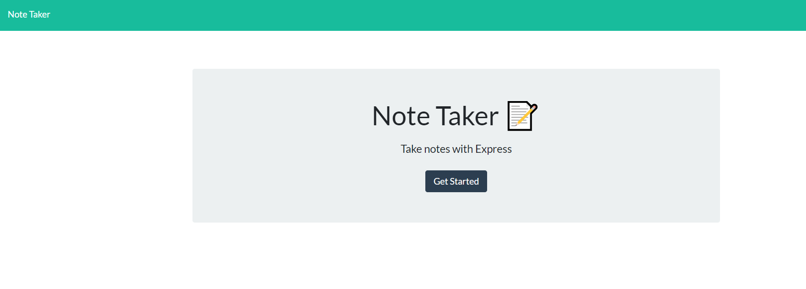
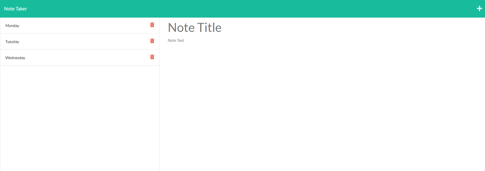

# Note-Taker

## Description

It's an application that allows user to take notes that can be used to write and save notes.

## Installation
To run this application you need to install npm inquirer and Jest

## Built with 
    *   HTML
    *   CSS
    *   Javascript
    *   Express.js
    *   Node.js
    *   npm

# Screenshot of my application

Application Link:

https://firstnotetaker.herokuapp.com/notes

## Contributing

Mital Goghari
